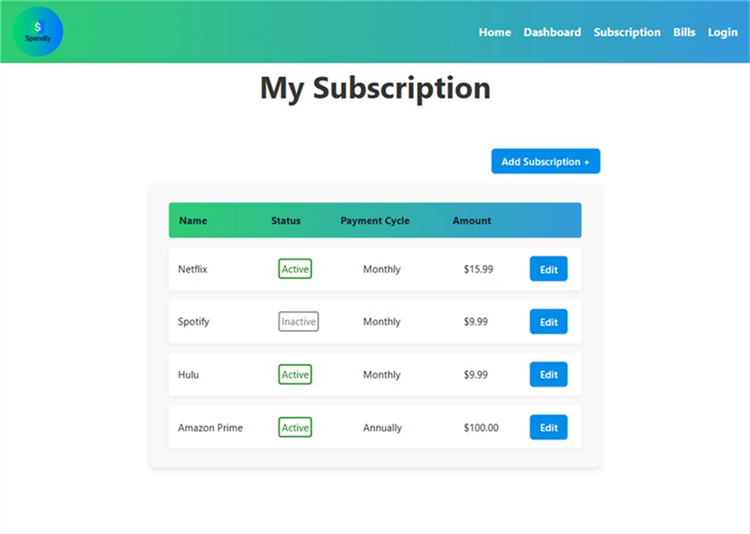
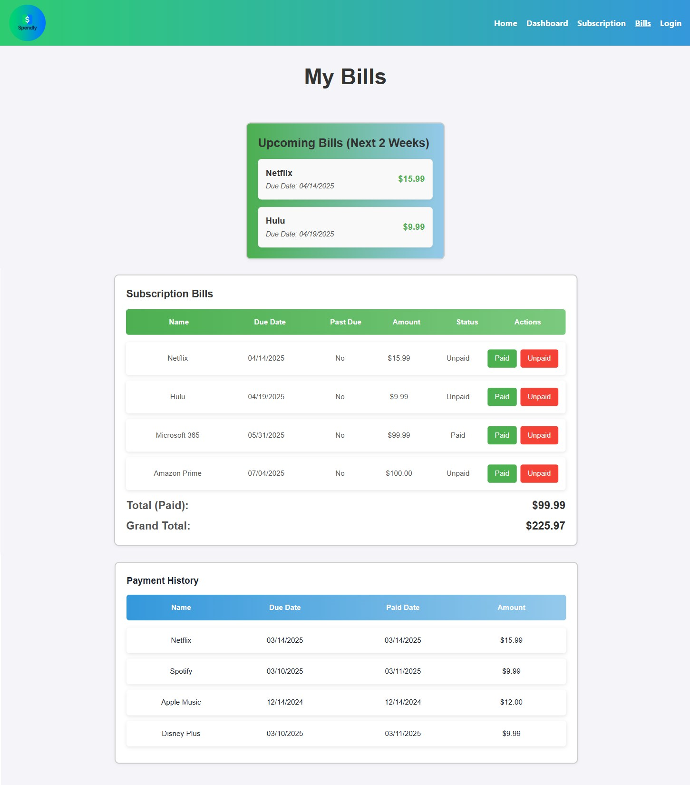

# Spendly

[](https://opensource.org/licenses/MIT)

## Table of Contents

- [Description](#description)
- [Installation](#installation)
- [Features](#features)
- [Usage](#usage)
- [Contributing](#contributing)
- [Test](#test)
- [License](#license)
- [Questions](#questions)

## Description

Spendly is a MERN Stack application that is a user-friendly subscription tracker app designed to help users manage their subscriptions effortlessly. With features like subscription tracking, upcoming bill reminders, and payment history, Spendly will keep your fincances organized.

## Installation

To successfully run this application, these are the following installation dependencies requirements:

- Node.js
- Express.js
- React
- bcrypt
- JWT Token
- MongoDB
- Apollo Server Express
- Mongoose
- Chakra-UI
- dotenv

#### Set Up Environmental Variables

In the `server` folder, rename the `.env.EXAMPLE` to `.env`. Add your database connection string `MONGODB_URI` inside the `.env` file.

## Features
  **Subscription Management:**
  * Add, edit, or delete subscriptions.

  **Upcoming Bills:**
  * View bills due in the next two weeks and track past-due payments.

  **Payment History:**
  * Keep a record of all completed payments for easy reference.

## Usage
1. **Sign-Up / Login:** Access your personalized Spendly Subscription Tracker.
2. **Add Subscription:** Input your services, status (Active/Inactive), and cost .
3. **Edit / Delete Subscriptions:** Manage your list of subscriptions.
4. **Track Bills:** Monitor upcoming payments and keep tabs on overdue payments.
5. **View History:** View payment records for reference and financial insights.

Here is an example screenshot of the Spendly App:

[Deployed Application on Render](https://spendly-client.onrender.com/)





## Contributing

These are all the contributors that contributed to creating this application:

- [jutalexa2024](https://github.com/jutalexa2024)
- [Nolan-Marshke](https://github.com/Nolan-Marshke)
- [laneman952](https://github.com/laneman952)
- [jbarry89](https://github.com/jbarry89/)

## Test

Type the code below in the terminal, running each line of code separately.

1. Install the Dependencies:

```bash
npm install

```

2. Build the Application:

```bash
npm run build

```

3. Seed the Database (Ensure MongoDB is installed before this step):

```bash
npm run seed

```

Start the Application

```bash
npm run dev

```

## License

This project is Licensed under the MIT License.

## Questions

Feel Free to contact me for any additional questions

- GitHub: [jbarry89](https://github.com/jbarry89/)
- Email: joelbarry8907@hotmail.com
